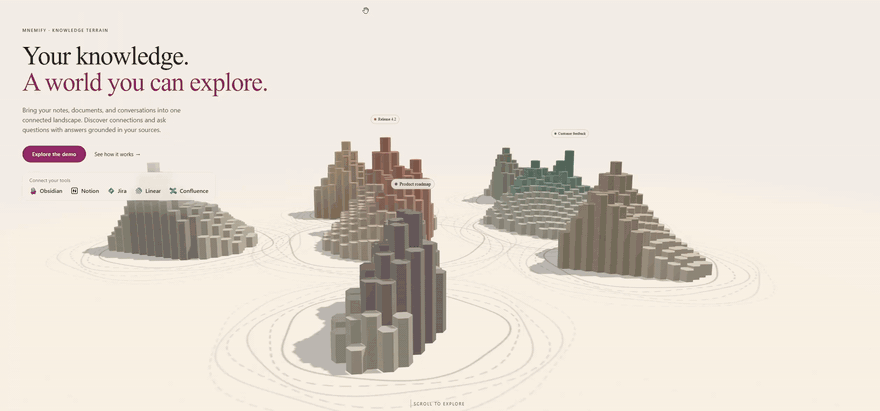

<p align="center">
  
</p>

<h3 align="center">Built for us. Shared with everyone who works like us.</h3>

<p align="center">
  <a href="https://mnemify.ai"></a>
  <a href="backend/pyproject.toml"></a>
  <a href="LICENSE"></a>
  <a href="backend/pyproject.toml"></a>
  <a href="frontend/web/package.json"></a>
  <a href="https://github.com/mnemify-ai/mnemify/stargazers"></a>
</p>

<br>

<p align="center">
  <a href="https://github.com/user-attachments/assets/2bf6614e-cd72-4a0c-9ea2-017d22d91155">
    
  </a>
</p>

<p align="center"><sub>Click the preview to watch the full-resolution demo.</sub></p>

Our knowledge was scattered across Notion, Confluence, Obsidian vaults, Zoom meeting notes, Google meeting notes and so on.... We built Mnemify to bring it together into one connected, searchable map — and we use it every day to rediscover what we know and give our AI tools better context.

For several month we have been using this product ourselves and found it very useful. Now we are sharing it with you. 

## How it works

Mnemify is **AI context infrastructure**: a portable, persistent knowledge graph built from the tools you already work in. It runs in three tiers:

1. **Harvest** — pull your notes and wikis from Notion, Confluence, and Obsidian into native formats, deduplicated by content hash. Deterministic; no LLM.
2. **Compile** — chunk, tag, semantically cluster, and lay out the harvested content into an emergent terrain: regions and peaks are based on embedding proximity, not a fixed folder taxonomy.
3. **Surface** — a FastAPI server + a React app: a 3D hex map of everything you've worked on, source-grounded attention signals, chat over the compiled terrain graph, and JSON artifacts downstream AI clients can use as compact context.

Everything Mnemify generates lives in one folder on your machine, outside this repo. Nothing is written back to your sources.

---

## Install

You need **Node.js 18 or newer**. Setup installs **[uv](https://docs.astral.sh/uv/)** for you if it's missing, and uv brings its own Python 3.11+.

| | |
|---|---|
| **Clone** | `git clone https://github.com/mnemify-ai/mnemify && cd mnemify && sh setup.sh`<br>Windows: clone it, then double-click `setup.bat`. |
| **Download ZIP** | [`main.zip`](https://github.com/mnemify-ai/mnemify/archive/refs/heads/main.zip) → unzip → `sh setup.sh` in the unzipped folder (Windows: double-click `setup.bat`). |
| **Developers** | Two terminals, hot reload: `cd backend && uv sync && uv run mnemify up --reload --no-browser` and `cd frontend/web && npm install && npm run dev` → <http://localhost:5173>. |

Setup installs the backend, builds the web app, creates a **Mnemify** icon (macOS: `~/Applications`; Linux: your app menu; Windows: Desktop + Start Menu), and opens the app on <http://127.0.0.1:8783>.

On Windows, double-clicking `setup.bat` is fine. It runs PowerShell with `-ExecutionPolicy Bypass` for that one process only — nothing in your system settings is read or changed.

## Start and stop

Click the **Mnemify** icon, or run `sh mnemify.sh` (Windows: `mnemify.bat`) from the repo folder. If it's already running, it just opens the browser again.

Mnemify stops itself after 30 idle minutes — change that, or quit it now, under **Settings → General**. From a terminal: `cd backend && uv run mnemify stop`.

## Where your data lives

Your harvested documents, the compiled map, your settings and your keys live in one per-user folder **outside this repo**:

| | |
|---|---|
| macOS | `~/Library/Application Support/Mnemify` |
| Windows | `%LOCALAPPDATA%\Mnemify` |
| Linux | `~/.local/share/mnemify` (or `$XDG_DATA_HOME/mnemify`) |

To put it somewhere else, set the `MNEMIFY_HOME` environment variable before launching. It must be set in every shell (or shortcut) that starts Mnemify, so add it to your shell profile:

```sh
# macOS / Linux — e.g. in ~/.zshrc or ~/.bashrc
export MNEMIFY_HOME="$HOME/mnemify-data"
```

```powershell
# Windows (PowerShell) — persists for your user account
[Environment]::SetEnvironmentVariable("MNEMIFY_HOME", "D:\mnemify-data", "User")
```

The folder is created on first launch. The repo folder holds nothing but code: deleting it, replacing it with a fresh download, or moving it never touches your data.

## Updating

1. Get the new code — `git pull`, or unzip a fresh [`main.zip`](https://github.com/mnemify-ai/mnemify/archive/refs/heads/main.zip) over the folder.
2. Run `sh setup.sh` again (Windows: `setup.bat`).

That's the whole update story. Setup is idempotent, and your data lives elsewhere, so nothing is lost.

## Connect your sources

Open **Build → Sources**. Mnemify harvests **Notion**, **Confluence**, and **Obsidian**, and each connect wizard walks you through pasting a token, validating it, and choosing what to harvest:

- **Notion** — an internal integration token, shared with the pages you want.
- **Confluence** — your Atlassian email plus an [API token](https://id.atlassian.com/manage-profile/security/api-tokens).
- **Obsidian** — the path to your vault. No token at all.
- More will be added soon.

Nothing here needs a file edited. Tokens are written to your data folder, readable only by you, and never to the repo.

Then run a **harvest**, then a **compile**, and the home page turns into a living map of everything you've worked on. (Until you compile, it shows the connect → harvest → compile onboarding screen.) The first harvest and compile take a while; after that results are cached and later runs are much faster.

## AI models

The **Compile** step and **Chat** need a language model. You have three options, and Mnemify picks up whichever you have. Set keys under **Settings → AI & Models**:

- **OpenAI** (recommended) — set `OPENAI_API_KEY`. This is the default mode and the one we run day to day. Also provides the embeddings (multilingual, best map quality).
- **Claude Code** — if the `claude` CLI is installed and logged in, Mnemify detects it automatically and can use your Claude subscription for compile and chat, no API key needed. An Anthropic API key (`ANTHROPIC_API_KEY`) works too. Anthropic has no embeddings API, so with no OpenAI key Mnemify asks before your first compile whether to run a small embedding model on your computer instead (a one-time ~67 MB download, English-only, regions group a little more coarsely).
- **Local** — compiles deterministically with no key and no network. Good for a first look; the map is much better with a real model.

Embeddings (what groups notes into regions) come from OpenAI when an `OPENAI_API_KEY` is set, and otherwise from the on-device model once you agree to the download. Switch between them any time under **Settings → AI & Models → Embedding model**; a change takes effect on the next recompile from scratch.

## What it does (and doesn't)

Mnemify is **read-only**. It never edits Notion, Confluence, or any other source, and it never creates tasks or writes comments back. Your source pages stay the system of record; Mnemify is the map on top of them.

On top of the semantic map, Mnemify pulls out **attention signals** straight from your content — todos, risks, decisions, open questions, owners, and recent changes — and rolls them up into an urgency score for every region and topic. Flip the map into the **Burning** overlay and the same terrain is tinted by what needs attention, without the geography changing under you. Clicking a region or tag shows its summary, active documents, and every signal behind it, each linked back to the source page.

**Chat** works over the compiled map rather than over raw documents: it starts from regions, topics, entities, and attention signals, then cites only the source passages it needs to ground an answer. That keeps context small and fast, and it's the same compact context Mnemify can hand to your other AI tools.

---

## Contributing

Issues and pull requests are welcome. [`AGENTS.md`](AGENTS.md) is the orientation guide for anyone working on the code, and each package has its own README ([`backend/`](backend/README.md), [`frontend/`](frontend/README.md)) with setup, commands, and tests.

## License

[MIT](LICENSE) — open source. Use it at work, modify it, redistribute it, and build products on top of it. Just keep the copyright notice.
