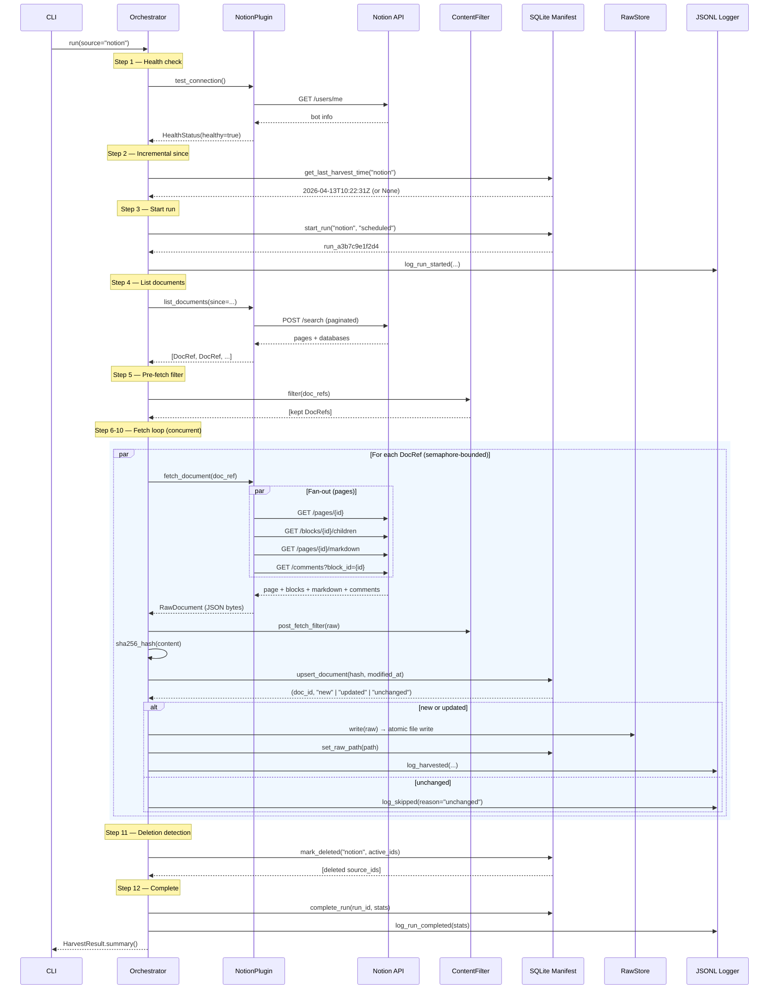
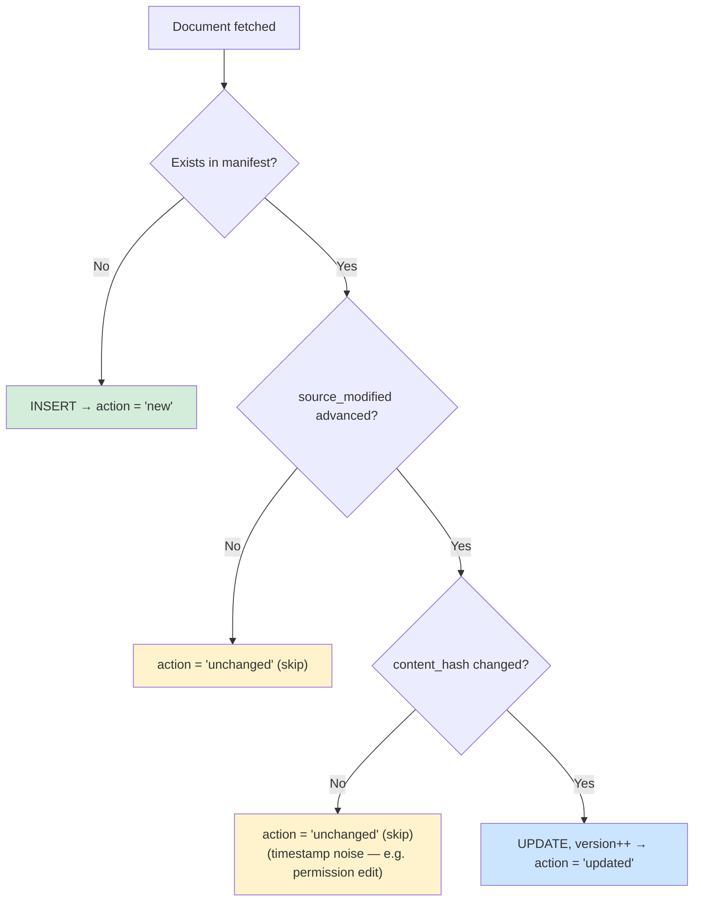
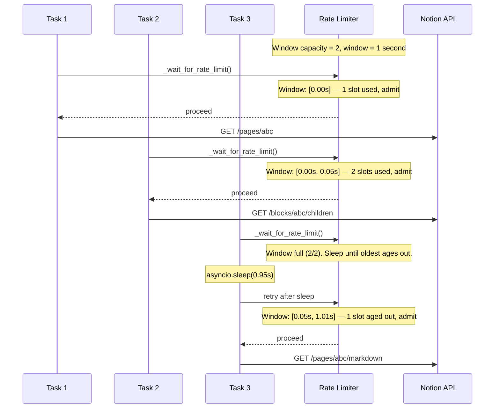
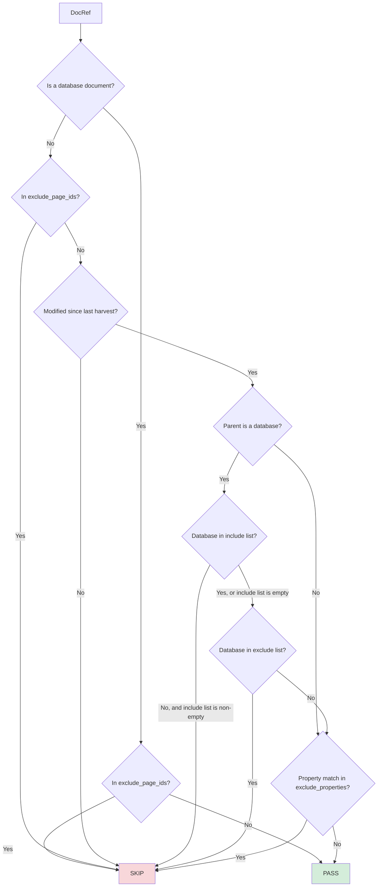
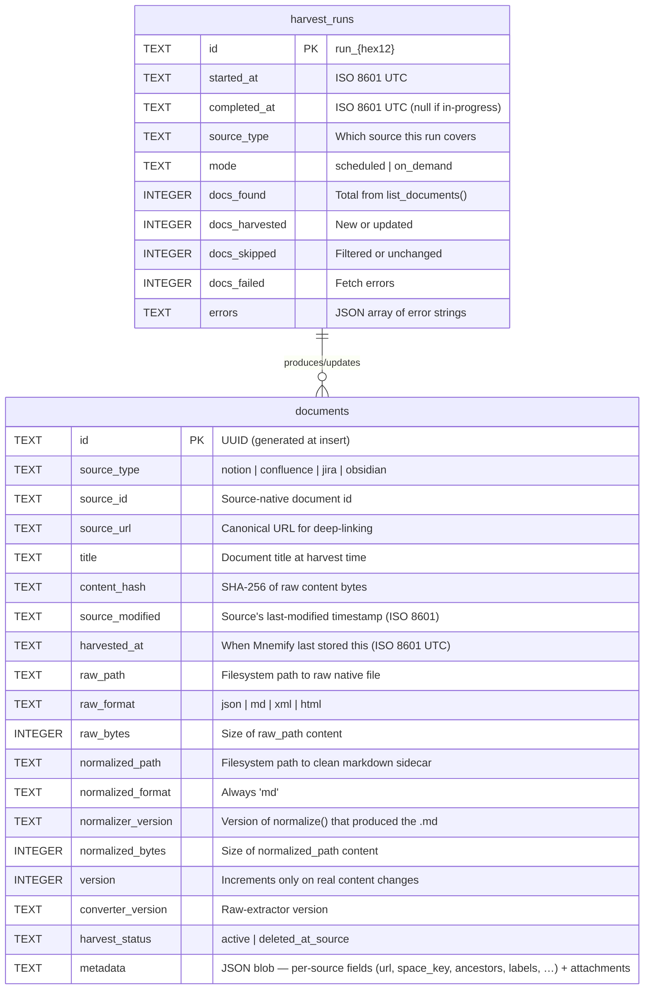

# Mnemify Backend — Architecture

> This is the detailed backend reference. For a one-page overview + how to run
> the app, see the repo `README.md`. For the cross-cutting end-to-end data
> flow, see `docs/TECHNICAL.md`. For the React app, see `docs/FRONTEND.md`.
>
> **Status:** §1–§12 (the harvester) and §13 (the terrain compiler) are
> current. §14–§17 (Notion API coverage, config, testing, roadmap) are
> broadly accurate; where any line here conflicts with `backend/src/`, the
> code wins.

## 1. System Overview

Mnemify is a three-tier knowledge-infrastructure pipeline — a supply chain for your professional knowledge: raw materials come in, get processed, and become a navigable map (and usable context for AI).

| Tier | Name | What it does | LLM? |
|------|------|--------------|------|
| 0 | **Harvester** (`src/harvester/`) | Pulls content from SaaS tools + local vaults, deduplicates by content hash, stores in native formats + a clean-markdown sidecar | No — fully deterministic |
| 1 | **Compiler** (`src/terrain/`) | Chunks the harvested docs, extracts features, clusters them into regions + tags, derives the v2 brain-map (`terrain.json`), and bakes the v3 hex render-data (`render-data.json`) — all under `.mnemify/` (§13) | OpenAI (feature extraction, naming, embeddings) — or a deterministic `local` mode |
| 2 | **Brain map + API** (`src/api/` + the React app) | A FastAPI server that serves the brain-map JSON, streams harvest/compile progress over SSE, and hosts the React UI (the 3D hex map + the connect/harvest/compile surfaces). A portable MCP surface — expose the graph to any AI client, BYOK — is planned. | No — bring your own model |

The Harvester is deliberately LLM-free: fetch, hash, deduplicate, store — every decision deterministic. The Compiler is where the LLM work happens, and even it has a no-network `local` mode.

**Setup & CLI.** From `backend/`: `pip install -e ".[dev]"` installs the package and a `mnemify` console script. `mnemify harvest` / `mnemify terrain build` / `mnemify up` / `mnemify status` / `mnemify reset` — or the equivalent `python -m src …`. The web app is normally launched from the repo root with `./run.sh` (see the repo README). Credentials are set up through the web connect wizard (Settings → Connections), not a CLI command.

Source connectors currently shipped or in-flight:

| Source | Kind | Raw format on disk | Status |
|---|---|---|---|
| **Notion** | Cloud API (HTTP) | `.json` — page + blocks + markdown + comments envelope | Shipped |
| **Obsidian** | Local filesystem | `.md` — byte-for-byte copy of the vault file | Shipped |
| **Confluence** | Cloud API (HTTP, Atlassian) | `.html` — `body.storage` XHTML byte-for-byte | Shipped |
| **Jira** | Cloud API (HTTP, Atlassian) | `.json` — raw `/issue/{key}` response with ADF bodies preserved | Shipped |

The plugin interface (`SourcePlugin`) is designed so that Gmail, Google Drive, and Slack connectors can be added without touching the orchestrator.

---

## 2. How a Harvest Works

This section walks through what actually happens when you run `python -m src harvest`, step by step, in plain English.

### The short version

The harvester connects to your Notion workspace, asks "what pages and databases exist?", compares the answer to what it already has stored locally, and only downloads the ones that have actually changed. Everything it downloads gets stored as raw JSON files on disk and tracked in a SQLite database.

### The long version

**Step 1 — Health check.** The orchestrator calls `GET /users/me` on the Notion API. If the token is invalid or the API is down, the run fails immediately. No point continuing if we can't talk to Notion.

**Step 2 — Figure out what's changed since last time.** The orchestrator looks up the `completed_at` timestamp of the most recent successful harvest run in SQLite. If this is the first ever run, `since` is `None` and we do a full backfill.

**Step 3 — Start a run.** A new row is inserted into the `harvest_runs` SQLite table with a unique `run_id` like `run_a3b7c9e1f2d4`. The JSONL audit log also records a `harvest_started` event.

**Step 4 — List everything.** The plugin calls `POST /search` on the Notion API (with cursor-based pagination) to get every accessible page and database. Each result becomes a lightweight `DocRef` — just metadata, no content yet. For pages, we also resolve the creator's display name from the user cache and extract flat property values (like Status, Priority, etc.) so the filter can use them.

**Step 5 — Filter before fetching.** The `ContentFilter` runs through every `DocRef` and decides whether to keep or skip it. This is where `include_databases`, `exclude_databases`, `exclude_page_ids`, `exclude_properties`, and timestamp gating all apply. Importantly, this happens *before* any content is downloaded — so filtering out 500 archived pages costs zero API calls.

**Step 6 — Fetch concurrently.** The surviving `DocRef`s are fetched in parallel, bounded by an `asyncio.Semaphore` (default: 5 concurrent fetches). For each page, four API calls fan out in parallel:

- `GET /pages/{id}` — page metadata
- `GET /blocks/{id}/children` — the full block tree (recursive, up to 10 levels deep)
- `GET /pages/{id}/markdown` — Notion's canonical markdown rendering
- `GET /comments?block_id={id}` — all comments on the page

For databases, two calls run in parallel: schema fetch + row query.

All four (or two) responses are assembled into a single JSON object and serialised to bytes. That's the `RawDocument`.

**Step 7 — Post-fetch filter.** If `min_content_length` is configured, the plain text is extracted and checked. A page with only 10 characters of content might not be worth storing.

**Step 8 — Hash and deduplicate.** The raw JSON bytes are SHA-256 hashed. The orchestrator calls `manifest.upsert_document()` which runs a two-gate check:

1. **Timestamp gate:** If `source_modified` hasn't advanced since last harvest → `"unchanged"`, skip.
2. **Hash gate:** If the timestamp *did* advance but the hash is identical → `"unchanged"`, skip. This catches noise like permission edits in Notion that bump `last_edited_time` without changing content.
3. Only if both gates pass → `"new"` or `"updated"`, proceed to store.

**Step 9 — Write to disk (raw).** The raw JSON bytes are atomically written to the sharded filesystem (see §4 for the layout). The manifest row is updated with the `raw_path` and `raw_bytes`.

**Step 9b — Normalize and write the .md sidecar.** The plugin's `normalize()` converts the raw bytes into a clean markdown body (no frontmatter for Confluence / Notion — all structured metadata lives in the manifest instead) and the result is atomically written under `.mnemify/normalized/`. The manifest row gains `normalized_path`, `normalized_format`, `normalizer_version`, and `normalized_bytes`. **Normalization failure is non-fatal** — raw remains the source of truth and `mnemify normalize --force` can retry. Before the upsert, the orchestrator merges `raw.metadata` (fetch-time, richer) over `doc_ref.metadata` (list-time) and persists the result into `documents.metadata` so fields that only exist after a full fetch (`space_key`, `ancestors`, `labels`, `version_number`, `author_name`, …) land in the manifest.

**Step 10 — Download attachments.** If the page contains images, files, or other embedded content, each attachment is downloaded from Notion's CDN (a separate HTTP client, since the CDN host differs from `api.notion.com`), written atomically to an `attachments/` subdirectory, and recorded in the document's `metadata` JSON blob.

**Step 11 — Detect deletions.** After all fetches complete, the orchestrator compares the set of source IDs returned by Notion against everything in the manifest. Any page in the manifest that Notion *didn't* return gets marked `"deleted_at_source"`. The raw files are kept until you explicitly run `python -m src purge`.

**Step 12 — Complete the run.** The `harvest_runs` row is updated with final stats (found, harvested, skipped, failed, duration). The JSONL log records a `harvest_completed` event. Done.

### Sequence diagram



---

## 3. Storage Internals

The harvester produces three forms of persistent storage: **raw native files** (the source of truth, under `.mnemify/raw/`), **normalized markdown sidecars** (clean, LLM-ready, under `.mnemify/normalized/`), and **a SQLite manifest** (the index that tracks everything). This section covers the file layouts.

### Directory tree

Raw files live under `.mnemify/raw/` in a **two-character sharded** directory structure. The first two characters of the Notion page/database UUID become the shard directory. This prevents any single directory from accumulating thousands of files, which causes performance problems on most filesystems.

```
.mnemify/
├── harvest-manifest.db          ← SQLite database (the index)
├── harvest-log.jsonl            ← Append-only audit log
├── raw/                         ← Native format — source of truth
│   └── notion/                  ← One directory per source type
│       ├── 2e/                  ← Shard: first 2 chars of source_id
│       │   ├── 2e297679-19c8-80d4-9e52-f4b8f708bd52.json   ← Page content
│       │   └── 2e297679-19c8-80d4-9e52-f4b8f708bd52/
│       │       └── attachments/
│       │           ├── a7f3c9e1b2d4f8a0.png                 ← SHA-256 prefix as filename
│       │           └── 9b2e4d6f8a1c3e5b.pdf
│       ├── 34/
│       │   └── 34197679-19c8-8026-a2a1-f9d54e3c2d0c.json   ← Database content
│       └── f1/
│           └── f1a2b3c4-...json
└── normalized/                  ← Clean markdown sidecars — LLM-ready
    └── notion/
        ├── 2e/
        │   └── 2e297679-19c8-80d4-9e52-f4b8f708bd52.md     ← Body text only
        └── 34/
            └── 34197679-19c8-8026-a2a1-f9d54e3c2d0c.md
```

Both trees use the same `{source_type}/{id[:2]}/{id}` sharding, so a document's raw bytes and its normalized sidecar are one path-transform apart. The normalized `.md` for Confluence and Notion contains **no YAML frontmatter and no metadata headers** — just body text. Structured metadata (url, space_key, labels, …) lives in the manifest's `documents.metadata` JSON column. Jira currently still emits a frontmatter-prefixed sidecar; Obsidian passes the vault file through unchanged.

### Atomic writes

Every file write uses a **tmp-file-then-replace** strategy. The content is first written to a sibling `.tmp_` file in the same directory, then `os.replace()` atomically swaps it into place. This guarantees that readers never see a half-written file — if the process crashes mid-write, only the tmp file is left behind (and the old version, if any, is untouched).

### Page JSON structure

Each harvested Notion page is stored as a single JSON file with four top-level keys:

```json
{
  "page": {
    "page_id": "2e297679-19c8-80d4-9e52-f4b8f708bd52",
    "title": "Take-off Estimation (ToE) Hub",
    "url": "https://app.notion.com/Take-off-Estimation-...",
    "created_at": "2026-01-08T10:03:00+00:00",
    "modified_at": "2026-04-13T19:51:00+00:00",
    "parent_type": "workspace",
    "parent_id": "workspace"
  },

  "blocks": [
    {
      "block_id": "2e297679-19c8-81a8-a9c3-ede42119e1dc",
      "type": "paragraph",
      "text_content": "This hub is for managing all work related to Take-off Estimation",
      "data": {
        "rich_text": [
          {
            "type": "text",
            "text": { "content": "This hub is for...", "link": null },
            "annotations": {
              "bold": false, "italic": false, "strikethrough": false,
              "underline": false, "code": false, "color": "default"
            },
            "plain_text": "This hub is for managing all work...",
            "href": null
          }
        ]
      }
    },
    {
      "block_id": "...",
      "type": "child_database",
      "text_content": "ToE Tasks",
      "data": { "title": "ToE Tasks" }
    }
  ],

  "markdown": "# Take-off Estimation (ToE) Hub\n\nThis hub is for managing...",

  "comments": [
    {
      "comment_id": "...",
      "author": "Jane Doe",
      "created_at": "2026-04-10T14:30:00+00:00",
      "text": "Let's revisit the priority column next sprint."
    }
  ]
}
```

**Why three representations of the same content?**

- **`blocks`** — the structured block tree with full Notion annotations (bold, italic, links, colours). This is the highest-fidelity representation. Blocks can nest recursively (a toggle containing a bulleted list containing a callout, etc.). The `text_content` field is a convenience extraction; `data` carries the raw Notion response.
- **`markdown`** — fetched directly from Notion's own markdown endpoint (`GET /pages/{id}/markdown`). This is the preferred source for plain-text extraction because Notion handles edge cases (tables, equations, mentions) better than we could by walking blocks. If the markdown fetch fails (it's a newer API endpoint), we fall back to block-walking.
- **`comments`** — stored separately because they live on a different API endpoint and are conceptually distinct from page content. Author names are resolved from user IDs via the `UserResolver` cache.

### Database JSON structure

Databases are stored differently — they contain a schema definition plus all rows:

```json
{
  "database": {
    "database_id": "34197679-19c8-8026-a2a1-f9d54e3c2d0c",
    "title": "Sprint Tracker",
    "url": "https://www.notion.so/...",
    "created_at": "2026-01-15T09:00:00+00:00",
    "modified_at": "2026-04-13T16:59:00+00:00",
    "properties_schema": {
      "Name": { "type": "title" },
      "Status": { "type": "select", "options": ["Not Started", "In Progress", "Done"] },
      "Priority": { "type": "select", "options": ["P0", "P1", "P2"] },
      "Assignee": { "type": "people" },
      "Due Date": { "type": "date" }
    }
  },
  "rows": [
    {
      "page_id": "34197679-19c8-8076-b957-f7183ba415f3",
      "title": "2026-04-13",
      "url": "https://www.notion.so/...",
      "created_at": "2026-04-13T16:54:00+00:00",
      "modified_at": "2026-04-13T16:59:00+00:00",
      "properties": {
        "Name": "2026-04-13",
        "Status": "In Progress",
        "Summary": ""
      }
    }
  ]
}
```

The schema and rows are fetched in parallel via `asyncio.gather` since they don't depend on each other. The Compiler (Tier 1) will be responsible for proper parsing and relationship linking — at this tier, we just store the raw structure.

---

## 4. Change Detection Deep Dive

Change detection is the core of incremental harvesting. Without it, every run would re-download and re-store every page, even if nothing changed. The harvester uses a **two-gate** system to be both efficient and accurate.

### The two-gate system



**Gate 1 — Timestamp.** If `source_modified` (Notion's `last_edited_time`) hasn't moved forward since the last time we harvested this document, we skip immediately. This is the fast path — most pages in a workspace don't change between runs, so we never even compare hashes for them.

**Gate 2 — Content hash.** If the timestamp *did* advance, we compute a SHA-256 hash of the full JSON bytes and compare it to the stored hash. If they match, the page is still `"unchanged"` — Notion bumped the timestamp but the actual content didn't change. This happens more often than you'd expect: permission changes, property reorders, and certain API-side metadata updates all bump `last_edited_time` without altering the block content.

**Why not just use the hash?** Because hashing requires fetching the full content first. The timestamp gate lets us skip the fetch entirely for pages that haven't been touched at all — which is the common case in a 500-page workspace where only 10 pages changed today.

### Version tracking

Each document row in the manifest has a `version` integer that starts at 1 when the document is first seen. It increments **only** when the content hash genuinely changes (i.e., the action is `"updated"`). So a page that has been updated 3 times with real content changes will be at version 4. This lets the Compiler know how many times a document has meaningfully changed, independent of how many harvest runs have occurred.

### Deletion detection

After all fetches complete, the orchestrator asks: "which source IDs are in my manifest but were *not* returned by Notion's search?" Those pages have been deleted (or the integration lost access to them). They get marked `harvest_status = 'deleted_at_source'` but their raw files are preserved on disk. To actually remove the files, you run `python -m src purge`.

The purge command supports `--older-than-days N` (only clean up deletions older than N days) and `--dry-run` (preview what would be removed).

### Source ID strategies and the rename problem

The `source_id` is the key that connects a document across harvest runs — it's how the manifest answers "have I seen this before?" Different sources generate this ID differently, and each strategy has trade-offs.

**Notion** uses its own page UUID (e.g. `2e297679-19c8-80d4-9e52-f4b8f708bd52`). Notion assigns this at creation time and it never changes, even if you rename the page, move it to another database, or change every property. This is the ideal case — renames and moves are invisible to the harvester; it just sees the same `source_id` with updated content.

**Obsidian** has no built-in document ID, so the plugin generates one by hashing the vault-relative file path: `SHA-256("notes/project-mnemify.md")[:16]` → `5e40d85325b5e706`. This is portable (moving the vault folder to a different disk doesn't change the IDs) but has a consequence: **renaming or moving a file produces a new `source_id`**.

If you rename `notes/project-mnemify.md` to `notes/mnemify-v2.md`, the next harvest sees:

1. The old ID (`5e40d85325b5e706`) is no longer returned by the vault scanner → marked `deleted_at_source`
2. The new ID (from hashing `"notes/mnemify-v2.md"`) has never been seen → inserted as a brand new document with `version: 1`

The content hash will be identical (you only renamed, not edited), but the harvester doesn't use content hash to correlate across source IDs. It treats them as two unrelated documents. The old content stays on disk (under the old shard path) until you run `purge`, and the version history resets.

**Why not use content hash as the primary ID?** Because two genuinely different notes can temporarily have the same content — copy-paste, templates, boilerplate pages. A content-based ID would merge documents that shouldn't be merged, which is harder to recover from than the rename case. The path-based ID is wrong on renames but correct on everything else.

**The planned fix:** rename detection is deferred to the **Compiler** (Tier 1). Since the Compiler sees both the `deleted_at_source` document and the newly `active` one within the same run window, it can compare their content hashes and infer "this is a rename, not a delete + create" — and preserve the link history in the knowledge graph. The Harvester stays simple and deterministic; the intelligence lives upstream.

### Converter versioning

Each manifest row records a `converter_version` (currently `"0.1.0"`) indicating which version of the pipeline produced it. If you improve the harvester — say, you add better comment parsing or richer block extraction — you bump the version and run:

```bash
python -m src harvest --below-converter-version 0.2.0
```

This selects all documents processed by an older pipeline version and forces them through the new one. The comparison is lexicographic, which works for semver strings.

---

## 5. Rate Limiting & Concurrency

The Notion API allows **3 requests per second**. Mnemify needs to stay under this ceiling while still making good use of parallelism. Here's how the two systems interact.

### The sliding window rate limiter

`NotionClient._wait_for_rate_limit()` implements a **sliding 1-second window** with configurable capacity. With defaults (`rate_limit=3.0`, `rate_buffer=0.5`), the effective capacity is `round(3.0 × 0.5) = 2` requests per second — deliberately leaving 33% headroom below the hard ceiling.



The key design detail: **the lock is only held around window mutation**, never across `asyncio.sleep`. This means while Task 3 is sleeping waiting for a window slot, Tasks 1 and 2 can complete and free up capacity without being blocked.

### The concurrency semaphore

The orchestrator uses an `asyncio.Semaphore(max_concurrent)` (default: 5) to limit how many documents are being fetched simultaneously. Each document fetch acquires the semaphore, does all its work (API calls, hashing, writing), and releases it.

**How the semaphore and rate limiter interact:** The semaphore controls how many *documents* are in flight. The rate limiter controls how many *API calls* happen per second. With 5 concurrent documents, each making 4 API calls, you could theoretically have 20 API calls queued — but the rate limiter ensures only 2 per second actually fire. The rest sleep efficiently via `asyncio.sleep`.

### Database fetch parallelism

When fetching a database document, the schema (`GET /data_sources/{id}`) and rows (`POST /data_sources/{id}/query`) are issued in parallel via `asyncio.gather` since they don't depend on each other. The rate limiter budgets them as separate requests.

### Attachment HTTP client

Attachments are served from a Notion CDN host (not `api.notion.com`), so they can't reuse the API client's `httpx.AsyncClient` (which is pinned to the API base URL). The plugin lazily creates a **single shared** `httpx.AsyncClient` on the first attachment download and reuses it for all subsequent downloads. This avoids paying a fresh TLS handshake per file, which matters when a page has 20+ embedded images.

### Retry strategy

All API calls go through `NotionClient._request()` which implements automatic retries with exponential backoff:

| Error type | Retried? | Delay |
|-----------|----------|-------|
| Network error (`httpx.RequestError`) | Yes, up to 3 times | 1s → 2s → 4s |
| 429 Too Many Requests | Yes, up to 3 times | Uses `Retry-After` header |
| 5xx Server Error | Yes, up to 3 times | 1s → 2s → 4s |
| 4xx Client Error (except 429) | No — fails immediately | — |

---

## 6. The Filter Pipeline

Filtering happens in two stages: **pre-fetch** (before downloading content) and **post-fetch** (after downloading but before storing). This design minimises wasted API calls.

### Pre-fetch filters (applied to DocRef metadata)

These are checked against the lightweight `DocRef` objects returned by `list_documents()`. No API calls are needed — everything is already in the metadata.



The filter checks are applied in this order (cheapest first):

1. **Explicit exclusion** (`exclude_page_ids`) — O(1) set lookup
2. **Timestamp gate** (`since`) — simple datetime comparison
3. **Database scoping** (`include_databases` / `exclude_databases`) — only applies to pages that are children of a database
4. **Property matching** (`exclude_properties`) — case-insensitive string comparison against resolved property values

Database documents (the schema+rows kind) are exempt from page-scope filtering — they only respect `exclude_page_ids`.

### Post-fetch filter (applied to RawDocument content)

After the content is downloaded, one additional check runs:

- **`min_content_length`** — if the extracted plain text is shorter than this threshold (in characters), the document is discarded. Useful for skipping empty placeholder pages. Set to 0 by default (no minimum).

The plain text extraction prefers Notion's markdown; if that's unavailable, it falls back to walking the block tree.

---

## 7. Error Handling & Edge Cases

### Per-document error isolation

If a single document fetch fails (network timeout, API error, malformed response), the orchestrator catches the exception, increments the `failed` counter, logs the error, and **continues with the next document**. One bad page doesn't kill the entire run. The `HarvestResult` at the end reports exactly which documents failed and why.

### Raw write failures

If the content fetches succeed but the filesystem write fails (disk full, permissions, etc.), the document is counted as `failed` and the manifest is *not* updated — so the next run will retry it. The orchestrator returns immediately from `_fetch_one()` after logging the error.

### Attachment download failures

Attachment downloads are individually try/caught. If one attachment out of five fails, the other four are still saved. The attachment manifest in the document's `metadata` JSON only includes successfully downloaded files. A warning is logged for each failure.

### Write-back conflict handling

The optional write-back feature (`PATCH /pages/{id}` to stamp a "Harvested At" property) handles two specific cases gracefully:

- **404 Not Found** — the page was deleted between harvest and write-back. Silently ignored.
- **409 Conflict** — another process edited the page concurrently. Silently ignored.

All other PATCH errors propagate so the orchestrator can log them, but they don't fail the document — write-back is best-effort.

### Markdown fetch fallback

The `GET /pages/{id}/markdown` endpoint is relatively new in the Notion API. If it fails for any reason, the harvester logs a warning and sets `markdown: null` in the stored JSON. Plain text extraction then falls back to walking the block tree — lossier, but functional.

### Comment fetch fallback

Similarly, if `GET /comments?block_id={id}` fails, comments are stored as an empty array. The page content itself is still fully captured.

### Concurrent modification during harvest

If a Notion page is edited while the harvester is fetching it, the blocks and markdown might represent slightly different snapshots. This is acceptable at Tier 0 — the next harvest run will pick up the final state, and the Compiler (Tier 1) is designed to handle minor inconsistencies.

---

## 8. The Audit Log

Every harvest action is recorded in an append-only JSONL file at `.mnemify/harvest-log.jsonl`. Each line is a self-contained JSON object with a UTC timestamp and an action type.

### Event types

| Action | When | Key fields |
|--------|------|------------|
| `harvest_started` | Run begins | `run`, `source`, `mode` |
| `harvested` | Document successfully stored | `run`, `source`, `id`, `title`, `version`, `change` ("new" or "updated"), `bytes` (size of raw payload) |
| `skipped` | Document filtered or unchanged | `run`, `source`, `id`, `title`, `reason` |
| `harvest_failed` | Document fetch error | `run`, `source`, `id`, `title`, `error` |
| `deleted_at_source` | Document no longer returned by the source | `run`, `source`, `id`, `title` |
| `attachment_downloaded` | Attachment saved | `run`, `source`, `parent`, `file`, `size` |
| `harvest_completed` | Run finished | `run`, `docs_found`, `docs_harvested`, `docs_skipped`, `docs_failed` |

### Example log entries

```jsonl
{"action":"harvest_started","run":"run_a3b7c9e1f2d4","source":"notion","mode":"scheduled","ts":"2026-04-14T10:22:01.123Z"}
{"action":"harvested","run":"run_a3b7c9e1f2d4","source":"notion","id":"2e297679-...","title":"Product Roadmap 2026","version":3,"change":"updated","bytes":18432,"ts":"2026-04-14T10:22:04.456Z"}
{"action":"skipped","run":"run_a3b7c9e1f2d4","source":"notion","id":"f1a2b3c4-...","title":"Team Handbook","reason":"unchanged","ts":"2026-04-14T10:22:06.789Z"}
{"action":"harvest_failed","run":"run_a3b7c9e1f2d4","source":"notion","id":"a1b2c3d4-...","title":"Archived Page","error":"HTTP 404: Page not found","ts":"2026-04-14T10:22:07.001Z"}
{"action":"harvest_completed","run":"run_a3b7c9e1f2d4","docs_found":47,"docs_harvested":12,"docs_skipped":35,"docs_failed":1,"ts":"2026-04-14T10:22:31.012Z"}
```

The log can be queried programmatically via `HarvestLogger.read_log(since=..., action_filter=..., limit=...)` or viewed through the `python -m src status` command which shows the last 10 entries.

---

## 9. Module Map

### `src/`

| File | Description |
|------|-------------|
| `__init__.py` | Package marker |
| `__main__.py` | Entrypoint for `python -m src` |
| `cli.py` | Argparse CLI: `harvest`, `status`, `inspect`, `purge`, `debug` |
| `config.py` | Typed env-var access (`get_notion_token`, `load_config`) |
| `config_file.py` | YAML config file loader (`mnemify.yaml`) |

### `src/harvester/`

| File | Description |
|------|-------------|
| `__init__.py` | `SourcePlugin` ABC + shared types (`DocRef`, `RawDocument`, `NormalizedDocument`, `AttachmentRef`, `HealthStatus`) |
| `filters.py` | `ContentFilter` + `FilterConfig` — pre/post-fetch document gating |
| `logger.py` | `HarvestLogger` — append-only JSONL audit log (`harvest_failed` carries `error`; `harvested` carries `bytes`) |
| `manifest.py` | `HarvestManifest` — SQLite-backed state store (dedup, deletion, run history, `raw_bytes` / `normalized_bytes`) |
| `orchestrator.py` | `HarvestOrchestrator` — drives a complete run end-to-end (raw write → normalize → attachments → manifest metadata merge) |
| `raw_store.py` | `RawStore` — atomic raw content and attachment writer |
| `normalized_store.py` | `NormalizedStore` — atomic writer for clean-markdown sidecars under `.mnemify/normalized/` |

### `src/harvester/notion/`

| File | Description |
|------|-------------|
| `__init__.py` | Package marker |
| `client.py` | `NotionClient` — async HTTP with rate limiting, retries, pagination |
| `models.py` | Dataclasses: `NotionPage`, `NotionBlock`, `NotionDatabase`, `NotionDatabaseRow`, `NotionAttachment`, `NotionComment` |
| `pages.py` | `PageExtractor` — page listing, block tree fetching, plain-text rendering, markdown fetch; `AttachmentExtractor` — discovery and download |
| `databases.py` | `DatabaseExtractor` — database listing, row querying, property resolution |
| `comments.py` | `CommentExtractor` — comment fetching and rendering |
| `users.py` | `UserResolver` — workspace user caching and ID-to-name resolution |
| `plugin.py` | `NotionHarvesterPlugin` — implements `SourcePlugin` for Notion; `normalize()` emits a clean-body markdown sidecar (prefers Notion's pre-rendered markdown; falls back to block-walking; database rows get a lossy schema-and-titles summary) |

### `src/harvester/obsidian/`

| File | Description |
|------|-------------|
| `__init__.py` | Package exports + plugin registry self-registration |
| `models.py` | `ObsidianVaultConfig` dataclass — vault path, watch folders, ignore patterns |
| `scanner.py` | `VaultScanner` — walks the vault directory tree with built-in + custom ignore rules |
| `parser.py` | `NoteParser` — YAML frontmatter extraction, `![[embed]]` attachment discovery and resolution |
| `plugin.py` | `ObsidianHarvesterPlugin` — implements `SourcePlugin` for local Obsidian vaults |

### `src/harvester/confluence/`

| File | Description |
|------|-------------|
| `__init__.py` | Package exports + factory that resolves email/token env vars and registers `confluence` |
| `models.py` | `ConfluenceConfig` + `ConfluencePage` dataclasses |
| `client.py` | `ConfluenceClient` — async façade over `atlassian-python-api` (sync calls wrapped in `asyncio.to_thread`, tenacity retry on 429/5xx) |
| `pages.py` | `PageExtractor` — `list_pages`, `get_full_page`, `list_page_attachments` across configured space keys |
| `extractor.py` | `html_to_plain_text` — deterministic XHTML → plain text via `beautifulsoup4` (strips macros, preserves code/tables) |
| `normalizer.py` | `confluence_to_markdown` — storage-format XHTML → clean body markdown via a `markdownify` subclass; emits **no frontmatter** (metadata lives in the manifest) |
| `plugin.py` | `ConfluenceHarvesterPlugin` — implements `SourcePlugin`; raw output is `.html` (Confluence `body.storage` XHTML), normalized output is a clean `.md` sidecar |

### `src/harvester/jira/`

| File | Description |
|------|-------------|
| `__init__.py` | Package exports + factory that resolves email/token env vars and registers `jira` |
| `models.py` | `JiraConfig` + `JiraIssue` dataclasses |
| `client.py` | `JiraClient` — async façade over `atlassian-python-api` (JQL search, issue get, field list, attachment download) |
| `issues.py` | `IssueExtractor` — JQL enumeration across project keys, pagination, `get_full_issue` |
| `jql.py` | `build_jql` — deterministic JQL string builder; enforces Atlassian's quoted `updated >= "yyyy-MM-dd HH:mm"` format, validates project-key shape |
| `adf.py` | `text_from_adf` — plain-text flattener for Atlassian Document Format bodies |
| `fields.py` | `discover_story_points_field` (auto-matches by name) + `flatten_issue_fields` (non-lossy metadata projection) |
| `plugin.py` | `JiraHarvesterPlugin` — implements `SourcePlugin`; raw output is `.json` (raw `/issue/{key}` response with ADF preserved) |

### `src/harvester/registry.py`

| File | Description |
|------|-------------|
| `registry.py` | Plugin factory registry — `register_plugin()` / `create_plugin()` for source-agnostic instantiation |

### `src/terrain/` — the compiler (Tier 1)

| File | Description |
|------|-------------|
| `compiler.py` | `TerrainCompiler` — drives one end-to-end compile: reader → chunker → extractor → embedder → store-cache → clusterer → layout → namer → derive → validate → emit → v3 bake. Writes only to `.mnemify/`. Has `_CompileCancelled` (cooperative cancel via a `threading.Event`) and emits a stream of `progress` events. |
| `models.py` | The v2 brain-map Pydantic schema — single source of truth (internal pipeline types + the `BrainMap` / `BrainMapNotes` output types + `validate_bidirectional`) |
| `reader.py` | `TerrainReader` — loads `active` manifest rows + their normalized markdown into `SourceDocument`s |
| `chunker.py` | `MarkdownChunker` — heading-aware chunks via `langchain-text-splitters` (recursive markdown splitter), with a fallback section splitter; merges tiny chunks, splits oversized ones |
| `extractor.py` / `openai_clients.py` | Feature extraction (summary, products, customers, entities, tags, `tag_type_hint`): `FeatureExtractor` (deterministic `local` mode) and `OpenAIFeatureExtractor` (Structured Outputs). Plus `OpenAIEmbeddingClient` / `OpenAIClusterNamer`. |
| `embedder.py` | `EmbeddingClient` — feature-text → embedding (cached; the `openai_clients` variant calls `text-embedding-3-small`) |
| `clusterer.py` | `TerrainClusterer` — deterministic feature bucketing → `(region_id, subregion_id, tag_id)` per chunk |
| `layout.py` | `TerrainLayout` — radial layout of regions / sub-regions / tags on the world plane, persistent seeds |
| `namer.py` | `ClusterNamer` / `OpenAIClusterNamer` — names themes / sub-regions / tags, cached by fingerprint |
| `emitter.py` | `BrainMapEmitter` — atomic writes of `.mnemify/terrain.json` (v2 BrainMap) + `mocknotes.json` |
| `render_v3.py` + `_bake_v3.py` | `bake_v3(terrain)` runs the v2→v3 hex-layout bake (force-directed region layout → hex grid → warped-Voronoi leaf assignment → tag spires + plateau heights + diffusion → `render-data.json`). `_bake_v3.py` is the algorithm core, vendored from the old offline bake script; `render_v3.py` is the entry point + call sequence. CPU-only (numpy). |
| `store.py` | `TerrainStore` — SQLite at `.mnemify/terrain.db`: feature cache, embedding cache, run history, assignments, region-merger verdicts (`merger_verdicts`, per run) |

### `src/api/` — the FastAPI server

| File | Description |
|------|-------------|
| `__init__.py` | App factory: mounts the route modules, an orphaned-run cleanup startup hook, and the built React SPA (`frontend/web/dist`) as a fallback route |
| `routes_connections.py` | `/api/connections/*` — the connect wizard surface (validate/discover/upsert/disconnect; reads `.env` + `mnemify.yaml`) |
| `routes_harvest.py` | `/api/harvest/*` — start / SSE-stream / cancel / history / reset |
| `routes_terrain.py` | `/api/terrain/*` — compile (async + SSE), the v2 brain-map JSON, the v3 render-data, the notes registry, run history, the compile report |
| `routes_documents.py` / `routes_settings.py` | `/api/documents/*` (browse harvested docs) and `/api/settings/*` (full reset) |
| `orchestrator.py` / `compile_orchestrator.py` | Glue between the UI lifecycle and the (real) harvest / terrain pipelines — run synchronous work in worker threads and publish progress onto the buses |
| `event_bus.py` / `compile_bus.py` | In-process pub/sub with a replay ring buffer — what the SSE streams subscribe to |
| `_sse.py` / `_rate.py` | Shared SSE serializer (`_json`) and the sliding-window `_Rate` ETA tracker |
| `credential_store.py` / `yaml_writer.py` | Read/write `.env` secrets and the `mnemify.yaml` source config (used by the connect wizard) |

### `src/utils/`

| File | Description |
|------|-------------|
| `hashing.py` | `sha256_hash()` — content hash for deduplication |

---

## 10. SQLite Schema

The harvest manifest is a SQLite database at `.mnemify/harvest-manifest.db`. It uses WAL journal mode for concurrent read performance and has foreign keys enabled.

### Entity relationship



### Column-by-column guide

**`documents` table:**

| Column | What it actually does |
|--------|---------------------|
| `id` | Internal primary key — a random UUID, *not* the Notion page ID. Never exposed outside the manifest. |
| `source_type` + `source_id` | Together form a unique constraint. `source_type` is `"notion"` (will be `"confluence"`, `"gmail"`, etc. for future sources). `source_id` is the Notion UUID. This pair is how the orchestrator looks up "have I seen this page before?" |
| `content_hash` | SHA-256 of the entire raw JSON bytes. This is the real dedup mechanism — even if the timestamp advances, if the hash matches, we skip. |
| `source_modified` | Notion's `last_edited_time`. Used as the **first gate** in change detection. Stored as ISO 8601 so it survives round-trips through SQLite's text type. |
| `harvested_at` | When *Mnemify* last wrote this row. Different from `source_modified` — this is our clock, not Notion's. |
| `raw_path` | Filesystem path to the stored native file. Nullable because the manifest row is inserted *before* the raw write (so we know the doc_id), then updated with the path after the write succeeds. |
| `raw_bytes` | `len(raw.content)` recorded alongside `raw_path`. Catches "harvester silently pulled a 0-byte page" bugs. |
| `normalized_path` | Filesystem path to the clean markdown sidecar produced by `plugin.normalize()`. Nullable — a plugin may choose not to normalize, or normalization may have failed (raw is preserved and `mnemify normalize --force` retries). |
| `normalized_format` | Always `"md"` when `normalized_path` is set. |
| `normalizer_version` | Version of the `normalize()` implementation that produced this sidecar. Bumping it makes old rows eligible for re-normalization. |
| `normalized_bytes` | `len(normalized.markdown.encode("utf-8"))` recorded alongside `normalized_path`. |
| `version` | Starts at 1, increments only when `content_hash` changes. A page at version 4 has had 3 genuine content updates since first discovery. |
| `converter_version` | Tracks which raw-extractor version produced this record. Enables `--below-converter-version` to re-harvest documents processed by an older pipeline. |
| `harvest_status` | Either `"active"` or `"deleted_at_source"`. Deleted pages keep their raw files until explicitly purged. |
| `metadata` | JSON blob carrying every per-source field not promoted to a first-class column. For Confluence / Notion this is where `url`, `space_key`, `ancestors`, `labels`, `version_number`, `author_name`, `parent_title`, etc. live — the orchestrator merges `raw.metadata` (fetch-time) over `doc_ref.metadata` (list-time) before upsert so the full picture lands here, not in the .md file. For pages with attachments, also contains the attachment manifest (filenames, local paths, hashes, sizes, MIME types). |

**`harvest_runs` table:**

| Column | What it actually does |
|--------|---------------------|
| `id` | Run identifier like `run_a3b7c9e1f2d4`. Used to correlate JSONL log entries with this run. |
| `completed_at` | Null while the run is in progress; filled in at the end. The most recent `completed_at` for a source becomes the `since` parameter for the next run. |
| `mode` | `"scheduled"` (default, from cron or automation) or `"on_demand"` (manual CLI invocation). Informational only — doesn't change behaviour. |
| `errors` | JSON array of error strings, one per failed document. Empty array `[]` for clean runs. |

---

## 11. Plugin Interface

Every source connector implements `SourcePlugin` (`src/harvester/__init__.py`):

```python
class SourcePlugin(ABC):
    async def test_connection(self) -> HealthStatus:
        """Verify auth and connectivity."""

    async def list_documents(self, since: datetime | None = None) -> list[DocRef]:
        """List available documents, optionally filtered by modification time."""

    async def fetch_document(self, doc_ref: DocRef) -> RawDocument:
        """Fetch full content in native format."""

    async def fetch_attachment(self, att_ref: AttachmentRef) -> bytes:
        """Download a single attachment."""

    def extract_plain_text(self, raw: RawDocument) -> str:
        """Best-effort plain text extraction (no LLM)."""
```

### The data types

- **`DocRef`** — a lightweight metadata-only reference. Contains `source_id`, `title`, `source_url`, `modified_at`, and a `metadata` dict. No content. Used for filtering before we spend API calls fetching.

- **`RawDocument`** — the fetched content. Contains `content` (raw bytes in native format), `format` ("json"), `metadata` (block count, attachment count, etc.), and `attachments` (list of `AttachmentRef`). The orchestrator never parses the content — it only hashes it.

- **`AttachmentRef`** — a reference to a downloadable file. Contains `source_id`, `filename`, `url`, and `mime_type`. The plugin's `fetch_attachment()` method downloads the actual bytes.

- **`HealthStatus`** — result of a connection test. `healthy` boolean, `message` string, optional `details` dict.

---

## 12. The Obsidian Plugin

The Obsidian plugin is the second source connector for Mnemify, proving that the `SourcePlugin` architecture works across fundamentally different source types. Where the Notion plugin talks to a cloud API over HTTP, the Obsidian plugin reads markdown files directly from the local filesystem. No running Obsidian app needed, no network calls, no API keys.

It plugs into the exact same orchestrator, manifest, raw store, filter, and audit log that Notion uses. The orchestrator doesn't know (or care) which source it's talking to.

### How an Obsidian harvest works

The flow follows the same 12-step lifecycle described in §2, but the "API calls" are filesystem operations:

**Step 1 — Health check.** Instead of `GET /users/me`, the plugin checks that the vault directory exists, is readable, and contains a `.obsidian/` sub-folder (that's how Obsidian marks a folder as a vault). It also does a quick `rglob("*.md")` count as a sanity check.

**Step 2 — List documents.** The `VaultScanner` walks the vault with `rglob("*.md")`, applying ignore rules as it goes. For each surviving file, `NoteParser.peek_frontmatter()` reads just the YAML header to extract title and tags — without loading the full content. Each file becomes a `DocRef` with metadata including the vault-relative path, folder name, tags, and the full frontmatter dict.

**Step 3 — Fetch.** Reads the file bytes directly from disk. The content is stored **byte-for-byte as markdown** — not wrapped in JSON like Notion pages. Your frontmatter, wikilinks (`[[links]]`), Dataview blocks, Templater syntax, and task checkboxes are all preserved exactly as written.

**Step 4 — Attachment discovery.** The parser scans the note body for Obsidian's `![[filename]]` embed syntax using a regex. Each reference is resolved to an absolute file path using Obsidian's own three-tier resolution order:

1. Exact path relative to vault root
2. Relative to the note's containing directory
3. Shortest-path match anywhere in the vault (Obsidian's default for unqualified filenames)

Only files with known attachment extensions (images, PDFs, Office docs, audio/video, archives) are included. Wikilinks to other `.md` notes are ignored — those are relationships, not attachments.

**Step 5 — Attachment fetch.** Instead of downloading from a CDN, the plugin reads the attachment bytes from the local filesystem.

**Steps 6–12** (hashing, dedup, manifest upsert, raw store write, deletion detection, run completion) are identical to Notion — the orchestrator handles all of this source-agnostically.

### The four source files

**`models.py`** — one dataclass: `ObsidianVaultConfig`.

```python
@dataclass
class ObsidianVaultConfig:
    vault_path: str               # Absolute path to the vault root (required)
    watch_folders: list[str]      # Limit scan to these vault-relative folders (empty = all)
    ignore_patterns: list[str]    # Additional glob patterns to exclude
```

**`scanner.py`** — `VaultScanner` walks the vault and yields `.md` file paths. It merges a built-in ignore list with user-configured patterns:

```python
# Always ignored regardless of user config
DEFAULT_IGNORE = [
    ".obsidian/*",     # Obsidian's own config/plugins
    ".mnemify/*",   # Harvester data + compiler output (avoid re-ingestion)
    ".trash/*",        # Obsidian's soft-delete folder
    ".Trash/*",        # macOS variant
    "node_modules/*",  # JS dependencies (if vault is also a code project)
]
```

Patterns ending in `/*` are directory prefix checks (skip the entire folder). Everything else uses `fnmatch`. Symlinks are skipped to prevent infinite loops in vaults that use them.

If `watch_folders` is configured, only those subtrees are walked. Otherwise the entire vault is scanned.

**`parser.py`** — `NoteParser` handles two responsibilities:

1. **Frontmatter extraction** — uses the `python-frontmatter` library to parse the YAML header. Returns `(title, metadata_dict)`. If there's no frontmatter (or it's malformed), returns `(None, {})` and the plugin falls back to using the filename as the title.

2. **Attachment discovery** — regex-matches all `![[...]]` embeds, strips display aliases (`![[file|alias]]` → `file`) and heading references (`![[file#heading]]` → `file`), resolves each to an absolute path, deduplicates, and returns a list of `AttachmentRef` objects.

**`plugin.py`** — `ObsidianHarvesterPlugin` implements all five `SourcePlugin` methods by wiring together the scanner, parser, and filesystem reads.

### The plugin registry

Both Notion and Obsidian register themselves via a factory pattern in `src/harvester/registry.py`. Each plugin's `__init__.py` calls `register_plugin()` at import time:

```python
# In obsidian/__init__.py
from src.harvester.registry import register_plugin
register_plugin("obsidian", _create_obsidian_plugin)
```

The CLI can then instantiate any registered plugin source-agnostically:

```python
from src.harvester.registry import create_plugin
plugin, closeable = create_plugin("obsidian", {"vault_path": "/path/to/vault"})
```

If a plugin's optional dependency is missing (e.g. `python-frontmatter` for Obsidian), its import is silently skipped — other plugins still register and work.

### Differences from Notion

| Aspect | Notion | Obsidian |
|--------|--------|----------|
| Content source | Cloud API (HTTP) | Local filesystem |
| Raw format stored | `.json` (structured: page + blocks + markdown + comments) | `.md` (byte-for-byte copy of the vault file) |
| Source ID | Notion's page UUID (stable across renames) | SHA-256 of vault-relative path (changes on rename/move) |
| Attachments | Downloaded from Notion CDN via HTTP | Read from local disk |
| Rate limiting | Yes — 3 req/sec sliding window | Not needed (filesystem reads) |
| `source_url` format | `https://app.notion.com/...` | `obsidian://open?vault=...&file=...` |
| Auth | `NOTION_TOKEN` env var | None (filesystem access) |
| Comments | Fetched separately via API | N/A (Obsidian has no comment system) |
| Databases | Schema + rows harvested as structured JSON | N/A (Obsidian has no database concept at the vault level) |
| Health check | `GET /users/me` | Directory exists + has `.obsidian/` folder |

### Obsidian-specific filtering

The `FilterConfig` was extended with an `ignore_frontmatter` field for Obsidian. It skips notes where a frontmatter key matches a given value:

```yaml
filter:
  ignore_frontmatter:
    mnemify_generated: true
```

This is important for avoiding re-ingestion loops: when the Compiler (Tier 1) generates wiki pages and writes them into the vault's `02-wiki/` folder, those pages typically have `mnemify_generated: true` in their frontmatter. The filter ensures the Harvester doesn't re-harvest the Compiler's own output.

The filter check runs during the pre-fetch stage (§6) as the fifth and final check, after exclude_page_ids, timestamp, database scoping, and property matching.

### What a document row looks like in SQLite

Here's a real row from a harvest of the test vault — the "Project Mnemify" note that contains an embedded image:

```
id:               6cacb724-4dcf-41a2-84fa-39ffc405b564   ← internal UUID (NOT the source ID)
source_type:      obsidian
source_id:        5e40d85325b5e706                        ← SHA-256("notes/project-mnemify.md")[:16]
source_url:       obsidian://open?vault=obsidian-vault&file=notes/project-mnemify.md
title:            Project Mnemify                          ← from YAML frontmatter "title:" field
content_hash:     sha256:833302bf61b6941b...              ← SHA-256 of the entire .md file bytes
source_modified:  2026-04-15T17:43:43+00:00               ← file mtime on disk
harvested_at:     2026-04-15T18:54:50+00:00               ← when Mnemify processed it
raw_path:         .mnemify/raw/obsidian/5e/5e40d85325b5e706.md
raw_format:       md
version:          1
converter_version: 0.1.0
harvest_status:   active
```

The `metadata` column for this note (it had an embedded `![[diagram.png]]`):

```json
{
  "attachments": [
    {
      "filename": "diagram.png",
      "local_path": ".mnemify/raw/obsidian/5e/5e40d85325b5e706/attachments/b1ff9c8ea3a780ba.png",
      "sha256": "sha256:b1ff9c8ea3a780ba...",
      "size": 69,
      "mime_type": "image/png"
    }
  ]
}
```

Compare that to a note with no frontmatter and no attachments — the "quick-note" inbox capture:

```
source_id:    e141819fd572121d       ← SHA-256("00-inbox/quick-note.md")[:16]
title:        quick-note             ← fallback to filename (no frontmatter title)
raw_format:   md
metadata:     {}                     ← no attachments
```

### What the raw file looks like on disk

Unlike Notion (where raw files are JSON envelopes), Obsidian raw files are the original markdown, untouched. The file at `.mnemify/raw/obsidian/5e/5e40d85325b5e706.md` is byte-for-byte identical to `notes/project-mnemify.md` in the vault:

```markdown
---
title: Project Mnemify
status: active
tags:
  - project
  - mnemify
priority: high
---

# Project Mnemify

The Mnemify knowledge compilation pipeline.

## Architecture
- Tier 0: Harvester (this code)
- Tier 1: Compiler (Gemini Flash)
- Tier 2: Integration Surface (MCP server)

## Sources
- [[Notion]] — primary workspace
- Obsidian — manual capture

## Diagram
![[diagram.png]]

## Related Notes
- [[q2-planning]]
- [[2026-04-15]]
```

The wikilinks (`[[Notion]]`, `[[q2-planning]]`), the embed (`![[diagram.png]]`), and the frontmatter are all preserved exactly. The Compiler is responsible for interpreting these — the Harvester just stores them faithfully.

### The test vault

A fixture vault is checked into the repo at `tests/fixtures/obsidian-vault/` with a realistic folder structure:

```
obsidian-vault/
├── .obsidian/
│   └── app.json                     ← Marks this as an Obsidian vault
├── 00-inbox/
│   ├── quick-note.md                ← No frontmatter (tests filename-as-title fallback)
│   └── web-clip.md                  ← Has frontmatter with source URL and tags
├── 02-wiki/
│   └── compiled-output.md           ← Has mnemify_generated: true (tests ignore_frontmatter)
├── attachments/
│   └── diagram.png                  ← Embedded by two notes (tests dedup + resolution)
├── daily/
│   └── 2026-04-15.md                ← Daily note with tasks and wikilinks
├── meetings/
│   └── q2-planning.md               ← Meeting note with attendees and ![[diagram.png]]
├── notes/
│   ├── project-mnemify.md            ← Core project note with wikilinks and embeds
│   └── nested/
│       └── deep-note.md             ← Tests recursive subdirectory scanning
└── templates/
    └── daily-template.md            ← Tests that templates/ is excluded by ignore patterns
```

Each fixture note tests a specific edge case: no frontmatter, deep nesting, shared attachments, Compiler-generated output, Templater syntax, etc.

### How to test it

**Unit tests (no vault needed, everything mocked or uses fixtures):**

```bash
cd mnemify/backend
pip install -e ".[dev]"

# Individual test files
pytest tests/test_obsidian_scanner.py -v      # VaultScanner: ignore patterns, watch_folders, symlinks
pytest tests/test_obsidian_parser.py -v       # NoteParser: frontmatter parsing, attachment resolution
pytest tests/test_obsidian_plugin.py -v       # Plugin: list_documents, fetch_document, extract_plain_text
pytest tests/test_obsidian_config.py -v       # ObsidianVaultConfig: defaults, validation
pytest tests/test_obsidian_failure_modes.py -v # Error handling: missing files, bad frontmatter, permissions

# All Obsidian unit tests at once
pytest tests/test_obsidian_*.py -v
```

**Integration test (runs against the fixture vault — no external dependencies):**

```bash
pytest tests/test_integration_obsidian.py -v -s
```

This is a full end-to-end run through the real orchestrator. It tests:

1. Health check passes on the fixture vault
2. `list_documents()` returns the expected 6 notes (excluding templates/ and .obsidian/)
3. `ignore_frontmatter` filter correctly skips `mnemify_generated: true` notes
4. Full orchestrator run writes `.md` raw files (not `.json`)
5. Manifest rows have `source_type="obsidian"`, `raw_format="md"`, and valid `raw_path`
6. JSONL log contains `harvest_started` / `harvested` / `harvest_completed` events
7. Second run reports all documents as `unchanged` and doesn't rewrite raw files (mtime check)
8. Deletion detection marks a note as `deleted_at_source` when the file is removed between runs

The integration test creates a temporary copy of the vault (via `shutil.copytree`) for the deletion test so it can safely delete a file without modifying the fixture.

**Manual test against your own vault:**

```python
import asyncio
from src.harvester.obsidian import ObsidianVaultConfig, ObsidianHarvesterPlugin

async def main():
    config = ObsidianVaultConfig(
        vault_path="/path/to/your/vault",
        ignore_patterns=["templates/*", "archive/*"],
    )
    plugin = ObsidianHarvesterPlugin(config)

    health = await plugin.test_connection()
    print(health.message)  # "Vault OK: 247 markdown files in MyVault"

    docs = await plugin.list_documents()
    for d in docs[:10]:
        print(f"  {d.title} — {d.metadata['folder']}/{d.metadata['relative_path']}")
        print(f"    tags: {d.metadata['tags']}, size: {d.metadata['size_bytes']} bytes")

asyncio.run(main())
```

Or through the full CLI with YAML config:

```yaml
# mnemify.yaml
source: obsidian
sources:
  obsidian:
    vault_path: /Users/you/Documents/MyVault
    watch_folders: ["notes", "meetings", "daily"]
    ignore_patterns: ["templates/*", "archive/*"]

filter:
  ignore_frontmatter:
    mnemify_generated: true
  min_content_length: 20
```

```bash
python -m src harvest --source obsidian
python -m src status
python -m src inspect <source_id> --source obsidian --content
```

---

## 13. The Terrain Compiler (Tier 1)

The compiler (`src/terrain/`) turns everything the harvester stored on disk into a navigable map: the **v2 brain-map** (`terrain.json` — regions, sub-regions, tags, edges, highlights, stats) and the **v3 hex render-data** (`render-data.json` — the honeycomb the 3D map renders). Both land under `.mnemify/`; a compile never touches the repo working tree.

### What it produces

```
.mnemify/
├── terrain.json       ← v2 BrainMap — the tree (themes → sub-regions → tags) + edges + highlights + stats
├── mocknotes.json     ← v2 BrainMapNotes — one Note per source doc (title, source, tags, excerpt, …)
├── render-data.json   ← v3 hex render-data ("cortex.brain-map.hex", version 3) — what the 3D map fetches
└── terrain.db         ← SQLite — feature cache, embedding cache, run history, chunk assignments
```

The API serves these at `GET /api/terrain` (the v2 BrainMap), `GET /api/terrain/notes`, and `GET /api/terrain/render-data`.

### The pipeline

```
reader → chunker → extractor → embedder → store-cache → clusterer
       → layout → namer → derive(v2 BrainMap + Notes) → validate → emit
       → bake_v3 → render-data.json
```

1. **Read** — `TerrainReader` loads `active` manifest rows + their normalized markdown into `SourceDocument`s.
2. **Chunk** — `MarkdownChunker` splits each doc into heading-aware chunks (langchain recursive markdown splitter; tiny chunks merged, oversized ones split).
3. **Extract** — per chunk, pull `summary`, `products`, `customers`, `entities`, `tags`, and a `tag_type_hint`. `ai_mode="openai"` uses OpenAI Structured Outputs (`OpenAIFeatureExtractor`); `ai_mode="local"` uses the deterministic `FeatureExtractor` (no network).
4. **Embed** — feature text → embedding (`text-embedding-3-small` in OpenAI mode; cheap deterministic vector in local mode). Cached in `terrain.db`.
5. **Cache** — features and embeddings are keyed by content hash, so a re-compile only re-runs the chunks that actually changed.
6. **Cluster** — `TerrainClusterer` deterministically buckets chunks into `(region_id, subregion_id, tag_id)`.
7. **Layout** — `TerrainLayout` places regions / sub-regions / tags on the world plane radially, with persistent seeds so positions are stable across runs.
8. **Name** — `ClusterNamer` (or `OpenAIClusterNamer`) names each theme, sub-region, and tag; cached by fingerprint so naming is paid for once.
9. **Derive** — assemble the v2 `BrainMap` (the 3-level tree, region/tag edges from doc co-occurrence, elevations = `100 · freq · recency · max(1,degree) / globalMax`, highlights — god / bridge / trending / isolated, bounds, stats) and `BrainMapNotes`.
10. **Validate** — Pydantic enforces the v2 invariants, and `validate_bidirectional()` checks tag↔note consistency and `crossRegion` correctness, before anything is written.
11. **Emit** — `BrainMapEmitter` atomically writes `terrain.json` + `mocknotes.json`.
12. **Bake** — `render_v3.bake_v3(terrain)` runs the v2→v3 hex bake (force-directed region layout → hex grid → warped-Voronoi leaf assignment → tag spires + plateau heights + height diffusion) and writes `render-data.json`. This step is non-fatal: if the bake fails the v2 terrain is still valid and the UI shows a "compiled — but the map didn't render, recompile" state.

The whole `build()` runs synchronously; the API's `compile_orchestrator` runs it in a worker thread and forwards a stream of `progress` events (`{"stage": "load"|"chunk"|"enrich"|"cluster"|"derive"|"validate"|"emit"|"render", "done"?, "total"?, "cached"?, ...}`) onto the SSE bus. Cancellation is cooperative — a `threading.Event` the compiler checks between chunks/names; an in-flight LLM call still finishes.

### Local mode

`mnemify terrain build --ai-mode local` (or `POST /api/terrain/build {"ai_mode":"local"}`) runs the entire pipeline with no network and no API key — deterministic feature extraction, embeddings, and naming. It's how the tests exercise the compiler end-to-end, and it's a fine way to see the shape of the output before paying for the OpenAI path.

### Versioning + caching

`TerrainCompiler.version` stamps `compiler.version` into every `terrain.json`. The feature cache key includes the extractor's `schema_version`, so bumping the extraction contract invalidates stale features without wiping the whole DB. Embeddings are keyed by the (model-specific) embedding text hash. `terrain.db` also records one row per run (`source`, `ai_mode`, stats, status) — that's what `GET /api/terrain/runs` and the compile report read. Since 2026-09-02 the run's `counts` carry a `render` block (regions/tags rendered vs compiled, land hexes, hexes per region) and the `merger_verdicts` table keeps every region-merger decision per run (similarity, decision, reason, the labels the judge saw) for audit and for `scripts/threshold_eval.py`.

---

## 14. Source API Coverage

What each connector calls upstream and how it stores what it gets.

### Notion

| Endpoint | Purpose | Status |
|----------|---------|--------|
| `GET /users/me` | Health check / bot info | Active |
| `POST /search` | Page and database listing (paginated) | Active |
| `GET /pages/{id}` | Page metadata | Active |
| `GET /blocks/{id}/children` | Block tree (recursive up to 10 levels) | Active |
| `GET /pages/{id}/markdown` | Canonical markdown rendering | Active |
| `GET /comments?block_id={id}` | Page comments | Active |
| `GET /users` | Workspace user list (for name resolution) | Active |
| `GET /users/{id}` | Individual user lookup | Active |
| `GET /data_sources/{id}` | Database schema (API 2025-09-03+) | Active |
| `POST /data_sources/{id}/query` | Database rows (API 2025-09-03+) | Active |
| `POST /search` (filter `data_source`) | Database listing | Active |
| `PATCH /pages/{id}` | Write-back opt-in stamp | Active (opt-in) |

**API Version:** `2026-03-11`

**Raw storage format:** `.json` envelope of page/database + blocks + markdown + comments.

### Confluence

| Endpoint | Purpose | Status |
|----------|---------|--------|
| `GET /rest/api/space` (limit=1) | Health check | Active |
| `GET /rest/api/space/{key}/content/page` | Page listing per configured space key, paginated | Active |
| `GET /rest/api/content/{id}` (expand `body.storage,ancestors,version,metadata.labels,metadata.properties`) | Full page fetch with ancestors and labels | Active |
| `GET /rest/api/content/{id}/child/attachment` | Attachment enumeration | Active |
| Authenticated attachment `download` URL | Attachment byte download | Active |

**Access:** `atlassian-python-api` (cloud mode), sync calls wrapped in `asyncio.to_thread`, tenacity retry on 429/5xx honouring `Retry-After`.

**Raw storage format:** `.html` — Confluence `body.storage` XHTML, UTF-8, byte-for-byte. No markdown conversion at harvest time.

**Out of scope for Phase 1:** comments, inline tasks, remote content, Server/Data Center.

### Jira

| Endpoint | Purpose | Status |
|----------|---------|--------|
| `GET /rest/api/3/myself` | Health check / auth verification | Active |
| `GET /rest/api/3/search` (JQL) | Issue enumeration, paginated on `startAt`/`total` | Active |
| `GET /rest/api/3/issue/{key}` | Full issue fetch with attachments | Active |
| `GET /rest/api/3/field` | Story-points custom-field auto-discovery (once per plugin instance) | Active |
| Authenticated attachment `content` URL | Attachment byte download | Active |

**Access:** `atlassian-python-api` (cloud mode), same async-wrapper + retry pattern as Confluence.

**Raw storage format:** `.json` — raw `/issue/{key}` REST response; ADF bodies preserved as ADF (not flattened).

**JQL driver:** `project in (...) AND updated >= "{since:%Y-%m-%d %H:%M}" ORDER BY updated DESC`. Incremental-since filter is server-side.

**Out of scope for Phase 1:** comments, issue links, worklogs, watchers, sprint/board enumeration, Server/Data Center.

---

## 15. Configuration

### Environment Variables

| Variable | Required for source | Description |
|----------|---------------------|-------------|
| `NOTION_TOKEN` | `notion` | Notion integration token (starts with `ntn_`). Get one at [notion.so/my-integrations](https://www.notion.so/my-integrations). |
| `CONFLUENCE_EMAIL` | `confluence` | Atlassian account email that owns the API token. |
| `CONFLUENCE_API_TOKEN` | `confluence` | Atlassian API token. Create one at [id.atlassian.com/manage-profile/security/api-tokens](https://id.atlassian.com/manage-profile/security/api-tokens). |
| `JIRA_EMAIL` | `jira` | Atlassian account email that owns the API token. |
| `JIRA_API_TOKEN` | `jira` | Atlassian API token (same create URL as above). The same token can be reused for Confluence and Jira on the same Atlassian cloud site. |

Obsidian has no required env vars (filesystem access only).

Copy `.env.template` to `.env` and fill in the credentials for whichever sources you plan to enable. The YAML `sources.*.email_env` / `token_env` fields name which env vars each plugin should read, so OAuth or alternate naming can be introduced later without breaking compat.

### Configuration File (`mnemify.yaml`)

Mnemify loads a YAML file in this search order:

1. `--config PATH` CLI flag
2. `./mnemify.yaml` (current working directory)
3. `~/.mnemify/mnemify.yaml`

CLI flags override file values. All keys are optional.

The current schema is **multi-source**: a top-level `sources:` map holds one block per plugin, keyed by source type. Global keys (`raw_root`, `converter_version`, `owner`) sit at the top level; per-source filtering, concurrency, and write-back live inside each source block. The loader is schema-less (YAML → dict) — unknown keys are ignored, and each plugin's dataclass is the authoritative schema for its slice. See `backend/example_mnemify.yaml` for a complete annotated example (copy it to `mnemify.yaml` — gitignored — and fill in your values).

```yaml
raw_root: .mnemify/raw          # Root directory for raw files (relative or absolute)
converter_version: "0.1.0"         # Pipeline version recorded in the manifest
owner: you@yourcompany.com         # Optional — recorded in terrain.json's owner block

sources:
  notion:
    enabled: true
    token_env: NOTION_TOKEN        # Env var that holds the integration token
    concurrency: 5
    filter:
      include_databases: []        # Only harvest pages from these DB IDs (empty = all)
      exclude_databases: []
      exclude_page_ids: []
      exclude_properties:
        - property: Status
          value: Archived
      min_content_length: 0
    write_back:
      enabled: false               # Stamp "Harvested At" property (Notion opt-in)
      property: "Harvested At"

  confluence:
    enabled: true
    base_url: "https://your-org.atlassian.net/wiki"
    email_env: CONFLUENCE_EMAIL
    token_env: CONFLUENCE_API_TOKEN
    space_keys: ["ENG", "PROD"]    # REQUIRED — Phase 1 is space-scoped
    concurrency: 3

  jira:
    enabled: true
    base_url: "https://your-org.atlassian.net"
    email_env: JIRA_EMAIL
    token_env: JIRA_API_TOKEN
    project_keys: ["CONN", "PLAT"] # REQUIRED — Phase 1 is project-scoped
    story_points_field: null       # null = auto-discover via `GET /field`
    concurrency: 3

  obsidian:
    enabled: true
    vault_path: "~/Documents/MyVault"
    watch_folders: []              # Empty = entire vault
    ignore_patterns: ["templates/*", "archive/*"]
    filter:
      ignore_frontmatter:
        mnemify_generated: true     # Avoid re-harvesting compiler-generated notes
```

**Legacy flat schema (deprecated, still accepted for backcompat).** Earlier configs used a top-level `source:` key with the plugin's settings inlined alongside it (e.g. `source: notion`, then `concurrency:`, `filter:` at the root). The config loader still reads this shape so existing files keep working, but new configs should use the `sources:` block above — it's what the multi-source CLI (`harvest --source jira`) and the compiler's per-source filtering rely on.

### CLI

After `pip install -e ".[dev]"` the `mnemify` console script is on `PATH`; `mnemify <cmd>` and `python -m src <cmd>` are equivalent.

```
mnemify harvest                       # Pull all accessible docs from every enabled source
  --source                    Source type (default: all enabled sources)
  --mode                      Run mode: scheduled | on_demand
  --concurrency               Max concurrent fetches (default: 5)
  --min-length                Minimum plain-text length to keep a document
  --config PATH               Path to mnemify.yaml config file
  --dry-run                   List + filter but skip fetch and write
  --force-full                Ignore incremental since; re-harvest everything
  --below-converter-version V Re-harvest docs with converter_version < V

mnemify terrain build                 # Tier 1 — compile → .mnemify/{terrain,mocknotes,render-data}.json
  --source                    Optional source filter, e.g. notion
  --ai-mode {openai,local}    OpenAI models (default) or the deterministic no-network local mode
  --llm-model                 OpenAI model for extraction + naming (default: gpt-4.1-mini)
  --embedding-model           OpenAI embedding model (default: text-embedding-3-small)
mnemify terrain schema --out PATH     # Export the v2 brain-map JSON Schema

mnemify up                            # Start the FastAPI server (serves /api/* + the built React SPA)
mnemify status [--json]               # Manifest stats + recent log activity
mnemify inspect <id> [--content]      # Print a document's manifest entry (and optionally its raw body)
mnemify normalize                     # Re-generate normalized markdown sidecars from stored raw files
mnemify purge [--older-than-days N] [--dry-run]   # Drop raw files for docs deleted at source
mnemify debug                         # Connection test + list documents + fetch one sample
mnemify reset                         # Wipe harvested data, disable every source, clear Mnemify-owned secrets
```

---

## 16. Testing Strategy

### Unit Tests (no API key)

```bash
pytest tests/ --ignore=tests/test_integration_harvest.py \
              --ignore=tests/test_live_atlassian_integration.py -v
```

All external calls are mocked. Uses `pytest-asyncio` with `asyncio_mode = "auto"` (no `@pytest.mark.asyncio` needed on new tests). SQLite manifests use `:memory:`.

### Integration Tests (fixtures, no creds)

Most integration tests run against checked-in fixtures — no network, no API keys:

| File | What it exercises |
|------|-------------------|
| `tests/test_integration_obsidian.py` | Full orchestrator run over the fixture vault (`tests/fixtures/obsidian-vault/`) — health check, listing, filter, fetch, manifest, JSONL log, deletion detection |
| `tests/test_integration_confluence.py` | End-to-end Confluence harvest against a mocked `atlassian-python-api` client |
| `tests/test_integration_jira.py` | End-to-end Jira harvest against a mocked client, including JQL-based incremental filtering |
| `tests/test_terrain_compiler.py` | Full terrain compile in `ai_mode="local"` — seeds a manifest, runs `TerrainCompiler.build()`, asserts `.mnemify/{terrain,mocknotes,render-data}.json` are written (and only there), the 3-level tree shape, and that the feature/embedding caches are reused on a second run |
| `tests/test_terrain_api.py`, `test_terrain_chunker.py` | The `/api/terrain/*` routes (compile lifecycle, the JSON endpoints, the report) and the `MarkdownChunker` split behaviour |

These all run in the default `pytest` invocation and need no environment setup. `pytest -q` is green except `tests/test_integration_harvest.py` (skipped without `NOTION_TOKEN`; a few of its cases reference harvester-plugin methods removed in a later refactor — see `docs/BACKLOG.md`).

### Integration Tests (real API)

Two integration tests actually hit live APIs and are opt-in via environment flags:

```bash
# Notion — skipped unless NOTION_TOKEN is set
NOTION_TOKEN=ntn_... pytest tests/test_integration_harvest.py -v -s

# Confluence + Jira — skipped unless RUN_ATLASSIAN_INTEGRATION=1
RUN_ATLASSIAN_INTEGRATION=1 \
CONFLUENCE_EMAIL=... CONFLUENCE_API_TOKEN=... \
CONFLUENCE_TEST_BASE_URL=... CONFLUENCE_TEST_SPACE_KEY=... \
JIRA_EMAIL=...        JIRA_API_TOKEN=... \
JIRA_TEST_BASE_URL=... JIRA_TEST_PROJECT_KEY=... \
pytest tests/test_live_atlassian_integration.py -v -s
```

Never point these at a production workspace — use a sandbox. Nothing is written under the repo (manifests use `:memory:`, logs use `tmp_path`).

### Debug Mode

Enable verbose logging during test runs:
```bash
pytest tests/ --mnemify-debug -v
```
Or set `MNEMIFY_DEBUG=1` in the environment.

### Coverage Focus Areas

- **`ContentFilter`** — timestamp, database scope, property-based, combined filters
- **`HarvestManifest`** — insert/update/unchanged detection, version increment, deletion tracking
- **`HarvestOrchestrator`** — lifecycle, concurrency, error isolation, deletion detection
- **`NotionHarvesterPlugin`** — fetch, extract, markdown preference, comment appending
- **`CommentExtractor` / `UserResolver`** — parsing, caching, graceful degradation
- **`AttachmentExtractor`** — discovery, download, error handling

---

## 17. Roadmap

### Built (in this repo)

- Notion page harvesting (blocks + markdown + comments)
- Notion database harvesting (schema + rows) — unified into `list_documents` / `fetch_document`
- Obsidian vault harvesting (local filesystem, frontmatter + wikilinks + embeds)
- Confluence page harvesting (Phase 1 — storage-format XHTML stored as `.html`)
- Jira issue harvesting (Phase 1 — raw `/issue/{key}` JSON with ADF preserved, JQL-driven incremental, story-points field auto-discovery)
- Attachment discovery and download — persisted under `.mnemify/raw/{source}/{shard}/{id}/attachments/`
- Incremental sync via content hashing + timestamp gating
- Deletion detection
- SQLite manifest with run history
- JSONL audit logging (including `attachment_downloaded` events)
- CLI: `harvest`, `status`, `inspect`, `purge`, `debug`
  - `harvest --dry-run`, `--force-full`, `--below-converter-version`, `--config`
  - `status --json`
  - `inspect --content`
  - `purge --older-than-days --dry-run`
- User resolution with workspace-scoped caching
- Raw file persistence — `.mnemify/raw/{source_type}/{shard}/{source_id}.{ext}`
- Write-back — `PATCH /pages/{id}` to stamp a "Harvested At" property (Notion, opt-in, off by default). `mark_harvested` is a no-op for Confluence and Jira.
- YAML configuration file (`mnemify.yaml`)
- **Terrain compiler** (`src/terrain/`) — chunk → extract → embed → cluster → layout → name → derive v2 brain-map → bake v3 hex render-data, with an OpenAI path and a no-network `local` mode (§13)
- **FastAPI server + React app** — connect wizards, live harvest/compile progress over SSE, the 3D hex brain map, the compile report; `mnemify up` / `./run.sh`

### In-Plan (deferred)

- Gmail / Google Calendar connectors — built in `src/harvester/{gmail,calendar}/` but not yet wired into the UI/CLI harvest path (kept out of the registry — and out of git — until then)
- Portable MCP surface — expose the compiled graph to any AI client (Claude Desktop, Cursor, …), BYOK
- Webhook receiver — real-time Notion change events; Attachment CDN — mirror Notion-hosted files with expiry handling
- Confluence/Jira: comments, issue links, worklogs, inline tasks, sprint/board enumeration, Server/Data Center deployments

(Forward-looking product/UX roadmap lives in `docs/ROADMAP.md`; the deferred-work backlog in `docs/BACKLOG.md`.)

### Future Sources

- Google Drive (Docs, Sheets, Slides)
- Slack (channels, threads, files)
